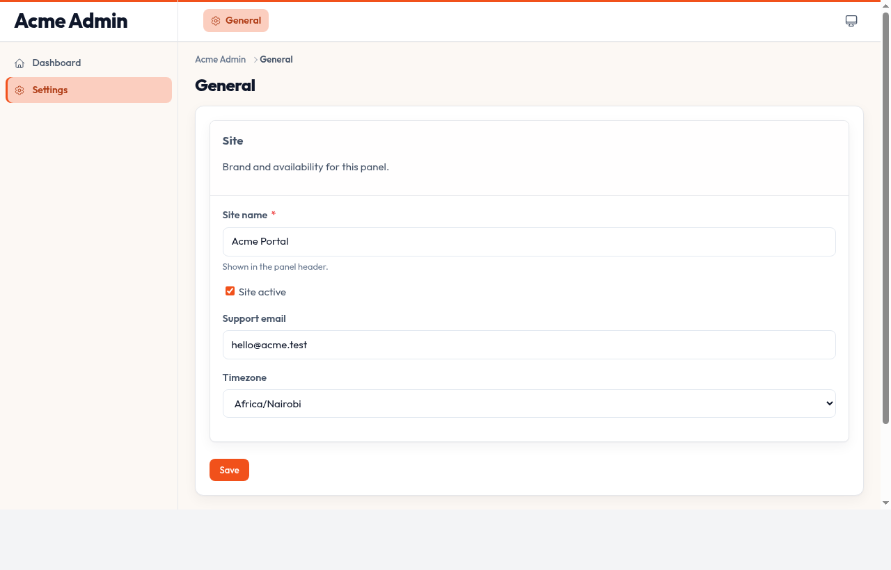
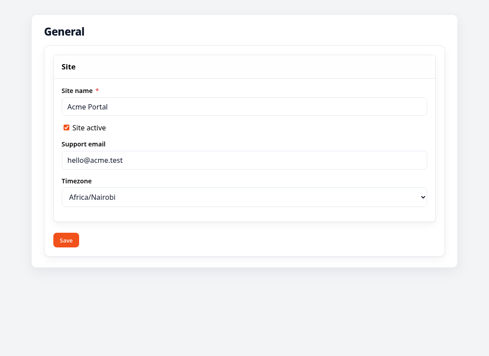
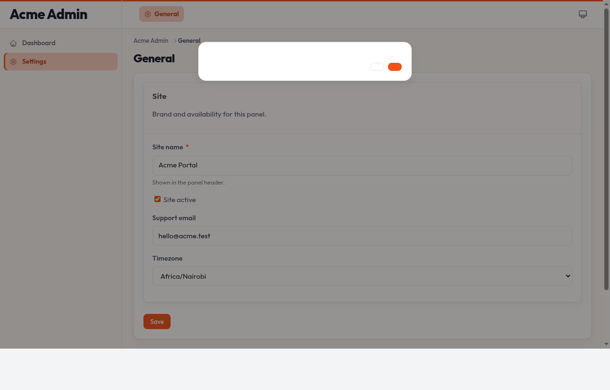

# Orbit Settings

Manage typed [Almasix Settings](https://github.com/almasix-dev/almasix-settings) visually in an Orbit panel.



<p align="center">
  
  
</p>

## Install

```bash
pip install almasix-settings almasix-orbit-settings
smith migrate
```

Optional Redis store: `pip install almasix-settings[redis]`.

Requires Orbit with Conduit-backed custom pages (`Page.get_conduit_host()`, shipped in Orbit ≥ the Conduit host pages release).

## Define settings

```python
# app/settings/general_settings.py
from almasix.settings import Settings

class GeneralSettings(Settings):
    site_name: str
    site_active: bool

    @classmethod
    def group(cls) -> str:
        return "general"
```

Seed defaults with `smith make:settings-migration` / `smith settings:migrate`.

## Settings page

```python
# app/orbit/app/pages/manage_general_settings.py
from almasix.orbit.forms import Form, TextInput, Toggle
from almasix_orbit_settings import SettingsPage
from app.settings.general_settings import GeneralSettings

class ManageGeneralSettings(SettingsPage):
    settings = GeneralSettings
    title = "General"
    slug = "general-settings"

    @classmethod
    def form(cls, form: Form) -> Form:
        return form.schema([
            TextInput.make("site_name").required(),
            Toggle.make("site_active"),
        ])
```

```bash
smith make:orbit-settings-page ManageGeneral --settings=GeneralSettings --panel=app
```

## Register the plugin

```python
from almasix_orbit_settings import SettingsPlugin
from app.orbit.app.pages.manage_general_settings import ManageGeneralSettings

panel.plugin(
    SettingsPlugin.make()
    .navigation_group("Settings")
    .pages([ManageGeneralSettings])
)
```

## Tenancy

Mark a Settings class `tenant_scoped = True`. The plugin binds Almasix’s tenant resolver to `panel.get_tenant()` when panel tenancy is enabled. Global defaults apply until a tenant saves its own values.

```python
class BrandingSettings(Settings):
    tenant_scoped = True
    brand_name: str

    @classmethod
    def group(cls) -> str:
        return "branding"
```

## License

MIT
